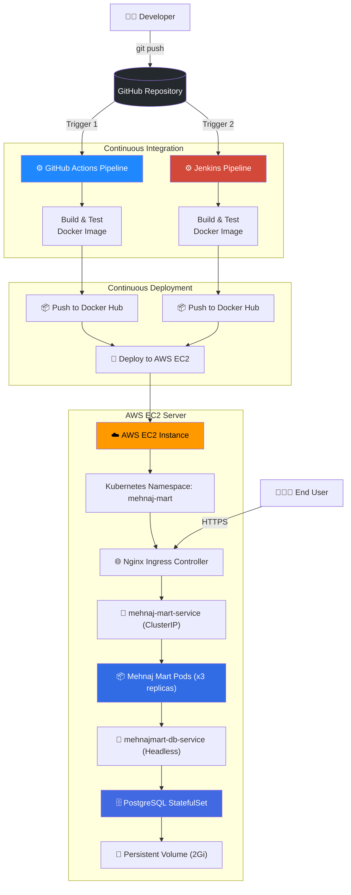
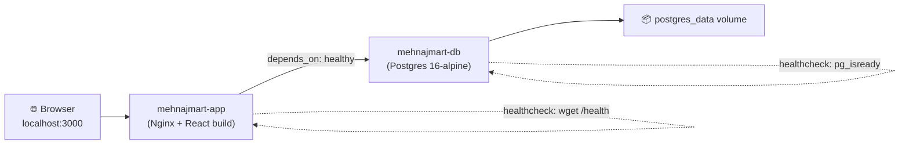
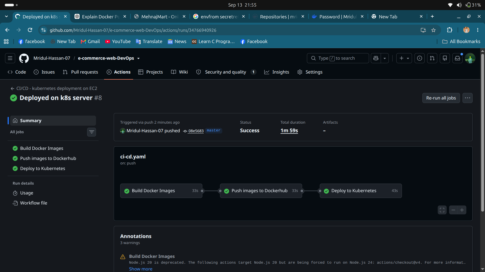
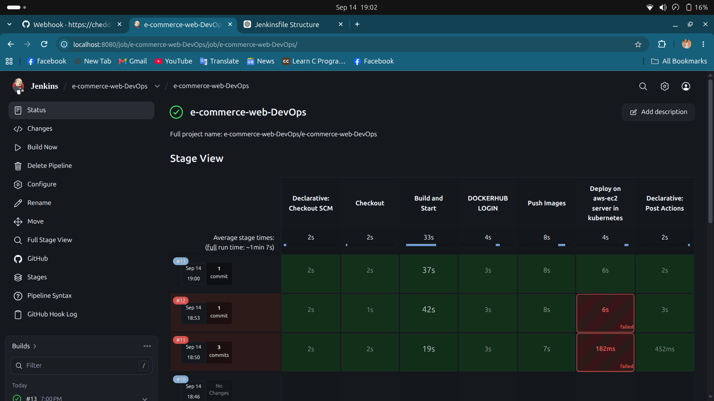

<div align="center">

# 🛒 Mehnaj Mart — E-Commerce Platform

### An end-to-end DevOps journey — from a React app to a fully containerized, Kubernetes-orchestrated, CI/CD-automated production deployment.

[](https://www.docker.com/)
[](https://kubernetes.io/)
[](https://github.com/features/actions)
[](https://www.jenkins.io/)
[](https://aws.amazon.com/ec2/)
[](https://nginx.org/)
[](https://www.postgresql.org/)
[](https://react.dev/)

</div>

---

## 📖 Overview

**Mehnaj Mart** is a modern React + TypeScript e-commerce web application, originally scaffolded by Google Studio AI, that I took from source code to a **production-grade, cloud-deployed system**. This repository is less about the storefront itself and more a demonstration of a complete **DevOps lifecycle**:

> `App code` → `Containerize` → `Orchestrate (K8s)` → `Automate (CI/CD)` → `Deploy (AWS EC2)` — twice, with two different pipelines.

This project intentionally implements **two parallel CI/CD pipelines** (GitHub Actions and Jenkins) targeting the same infrastructure, to demonstrate versatility across automation tooling.

---

## 🏗️ Architecture



### Local development architecture (Docker Compose)



---

## 🧰 Tech Stack

| Layer | Technology |
|---|---|
| **Frontend** | React, TypeScript, Vite |
| **Package Manager** | Bun / npm |
| **Web Server** | Nginx (Alpine) |
| **Database** | PostgreSQL 16 (Alpine) |
| **Containerization** | Docker, Docker Compose (multi-stage build) |
| **Orchestration** | Kubernetes (Deployment, StatefulSet, Service, Ingress, Secrets, Namespace) |
| **CI/CD — Pipeline 1** | GitHub Actions |
| **CI/CD — Pipeline 2** | Jenkins (Jenkinsfile) |
| **Cloud Hosting** | AWS EC2 |
| **Ingress** | Nginx Ingress Controller |

---

## 📂 Project Structure

```
e-commerce-web-DevOps/
├── src/                        # React + TypeScript application source
│   ├── components/             # Reusable UI components
│   ├── views/                  # Page-level views (admin, checkout, shop, etc.)
│   ├── context/                # Global app state (AppContext)
│   └── utils/                  # i18n & helpers
├── Dockerfile                  # Multi-stage build: Node (build) → Nginx (serve)
├── compose.yaml                # Local orchestration: app + Postgres
├── nginx.conf                  # Nginx reverse proxy / static serving config
├── k8s/                        # Kubernetes manifests
│   ├── namespace.yaml
│   ├── ingress.yaml
│   ├── mehnaj-mart/            # App Deployment, Service, Secret
│   └── postgresql/             # DB StatefulSet, Service, Secret
├── Jenkinsfile                 # Jenkins CI/CD pipeline definition
├── .github/workflows/          # GitHub Actions CI/CD pipeline definition
└── Outputs/                    # Screenshots documenting each deployment stage
```

---

## 🛠️ Build Journey — Step by Step

This project was built in deliberate, incremental stages — each one validated locally before moving to the next:

```mermaid
graph LR
    A["1️⃣ App Scaffolded<br/>(Google Studio AI)"] --> B["2️⃣ Dockerfile +<br/>compose.yaml written"]
    B --> C["3️⃣ Containerized &<br/>tested locally"]
    C --> D["4️⃣ Kubernetes manifests<br/>written & tested locally"]
    D --> E["5️⃣ GitHub Actions<br/>CI/CD pipeline built"]
    E --> F["6️⃣ Deployed to<br/>AWS EC2 (Pipeline 1)"]
    F --> G["7️⃣ Jenkins CI/CD<br/>pipeline built"]
    G --> H["8️⃣ Deployed to<br/>AWS EC2 (Pipeline 2)"]

    style A fill:#61DAFB,color:#000
    style C fill:#2496ED,color:#fff
    style D fill:#326CE5,color:#fff
    style F fill:#2088FF,color:#fff
    style H fill:#D24939,color:#fff
```



### 1. Application
The base storefront (product catalog, cart, checkout, order tracking, and a full admin portal for products/orders/customers/reports) was scaffolded with Google Studio AI, then customized.

### 2. Containerization
Wrote a **multi-stage `Dockerfile`**:
- **Stage 1 (`builder`)** — Node 20 Alpine installs dependencies and runs `npm run build`.
- **Stage 2 (`runner`)** — Nginx Alpine serves the compiled static `dist/` output, keeping the final image lightweight.
- A `HEALTHCHECK` hits `/health` every 30s so orchestrators can detect a truly "ready" container, not just a running process.

### 3. Local Orchestration
`compose.yaml` wires the app to a PostgreSQL 16 database, with:
- Environment-driven configuration (`.env`-backed variables — no secrets hardcoded)
- `depends_on: condition: service_healthy` so the app never starts before the DB is ready
- Named volumes and a dedicated bridge network for isolation

### 4. Kubernetes
Once validated in Compose, the same architecture was translated into native Kubernetes resources — all scoped to a dedicated `mehnaj-mart` namespace:

| Resource | Purpose |
|---|---|
| `namespace.yaml` | Isolates all project resources |
| `mehnaj-mart/deployment.yaml` | Runs **3 replicas** of the frontend, with liveness & readiness probes |
| `mehnaj-mart/service.yaml` | Internal `ClusterIP` load-balancing across pods |
| `mehnaj-mart/secret.yaml` | App env vars (`NODE_ENV`, `VITE_APP_NAME`) |
| `postgresql/statefulset.yaml` | Stable, persistent PostgreSQL instance with a `2Gi` PVC |
| `postgresql/service.yaml` | Headless service for stable DB network identity |
| `postgresql/secret.yaml` | DB credentials |
| `ingress.yaml` | Routes external traffic into the cluster via the Nginx Ingress Controller |

### 5–8. Dual CI/CD Pipelines → AWS EC2
Two independent pipelines were built to achieve the same outcome, showcasing tooling flexibility:

- **🔵 GitHub Actions** — triggers on push, builds & tests the Docker image, pushes to Docker Hub, then SSHes into the EC2 instance to pull and redeploy.
- **🔴 Jenkins** — a self-hosted `Jenkinsfile` pipeline performing the same build → push → deploy sequence, running on a Jenkins server also provisioned on the EC2 instance.

Both pipelines deploy to the **same AWS EC2 server**, proving the infrastructure and manifests are pipeline-agnostic.

---

## 🚀 Getting Started

### Prerequisites
- Docker & Docker Compose
- Node.js 20+ (for local dev without Docker)
- `kubectl` + a Kubernetes cluster (for K8s deployment)
- Docker Hub account (for image registry)

### Run locally with Docker Compose

```bash
# Clone the repo
git clone https://github.com/Mridul-Hassan-07/e-commerce-web-DevOps.git
cd e-commerce-web-DevOps

# Create a .env file with the required variables
cat <<EOF > .env
DOCKERHUB_USERNAME=yourusername
NODE_ENV=production
VITE_APP_NAME=MehnajMart
POSTGRES_DB=mehnajmart_db
POSTGRES_USER=mehnajmart_admin
POSTGRES_PASSWORD=change-me
PGDATA=/var/lib/postgresql/data/pgdata
EOF

# Build and run
docker compose up --build -d
```

The app will be available at **http://localhost:3000**.

### Deploy to Kubernetes

```bash
# Create the namespace
kubectl apply -f k8s/namespace.yaml

# Deploy the database layer
kubectl apply -f k8s/postgresql/

# Deploy the application layer
kubectl apply -f k8s/mehnaj-mart/

# Expose it via Ingress
kubectl apply -f k8s/ingress.yaml

# Verify
kubectl get all -n mehnaj-mart
```

> ⚠️ **Security note:** The `secret.yaml` files in this repo use plain **base64 encoding**, which is *not* encryption — anyone can decode it. Before deploying to a real cluster, generate secrets imperatively instead of committing them:
> ```bash
> kubectl create secret generic postgresql-secret \
>   --namespace mehnaj-mart \
>   --from-literal=POSTGRES_DB=mehnajmart_db \
>   --from-literal=POSTGRES_USER=mehnajmart_admin \
>   --from-literal=POSTGRES_PASSWORD='<use-a-strong-rotated-password>'
> ```
> For production, consider **Sealed Secrets**, **SOPS**, or a managed secrets store (AWS Secrets Manager / Parameter Store) instead of checking secret manifests into Git.

---

## 🔁 CI/CD Pipelines

<table>
<tr>
<td width="50%" valign="top">

### 🔵 GitHub Actions

- Triggered on push to `main`
- Builds the Docker image from the multi-stage `Dockerfile`
- Pushes the tagged image to Docker Hub
- Connects to the AWS EC2 instance and redeploys the updated container/stack



</td>
<td width="50%" valign="top">

### 🔴 Jenkins

- Defined declaratively in the `Jenkinsfile`
- Self-hosted Jenkins server running on the EC2 instance
- Same build → push → deploy flow, triggered independently of GitHub Actions



</td>
</tr>
</table>

### 📸 Deployment Gallery

<details>
<summary><strong>Application running in production</strong></summary>
<br>

 
 

</details>

<details>
<summary><strong>GitHub Actions run</strong></summary>
<br>

 
 

</details>

<details>
<summary><strong>Jenkins run</strong></summary>
<br>

 
 

</details>

---

## ✅ Key DevOps Practices Demonstrated

- 🐳 **Multi-stage Docker builds** for minimal, production-ready images
- 🩺 **Health checks** at both the container (`Dockerfile HEALTHCHECK`) and orchestration (`compose.yaml` / K8s probes) layers
- 🔗 **Service dependency management** so the app never boots ahead of its database
- ☸️ **Kubernetes-native design** — namespaced resources, StatefulSets for stateful workloads, headless services for stable DB networking, and PVCs for persistence
- 🔁 **Dual CI/CD pipelines** (GitHub Actions & Jenkins) proving pipeline-agnostic infrastructure
- ☁️ **Real cloud deployment** on AWS EC2, not just local demos
- 📸 **Documented, reproducible deployments** with screenshot evidence at every stage

---

## 🗺️ Roadmap

- [ ] Migrate plain-text K8s Secrets to Sealed Secrets / AWS Secrets Manager
- [ ] Add HTTPS/TLS termination at the Ingress via cert-manager + Let's Encrypt
- [ ] Add automated tests to the CI pipelines (unit + integration)
- [ ] Introduce Helm charts for templated, environment-aware K8s deployments
- [ ] Add Horizontal Pod Autoscaling (HPA) based on CPU/memory

---

## 📄 License

This project is available for educational and portfolio purposes. Feel free to explore the pipeline design and adapt it to your own projects.

---

<div align="center">

**Built with ❤️ as a hands-on DevOps case study — from code to cloud, twice over.**

</div>
